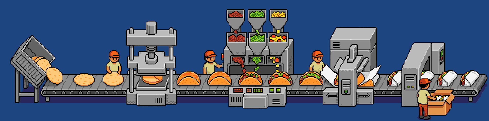
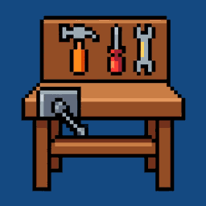
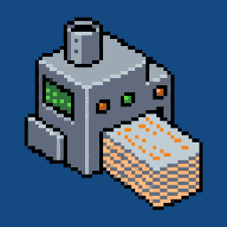

**Pushing to prod. Receipts at [alex-jacobs.com](https://alex-jacobs.com/).**

 

<table>
<tr>
<td align="center" valign="top" width="25%">
   
  <b><a href="https://github.com/alexjacobs08/tinybench">tinybench</a></b> 
  8 models, 40 exact tasks. 83% → 99% with tools.
</td>
<td align="center" valign="top" width="25%">
   
  <b><a href="https://alex-jacobs.com/posts/beatingbert/">beatingBERT</a></b> 
  Fine-tuned encoders measured against small LLMs.
</td>
<td align="center" valign="top" width="25%">
   
  <b><a href="https://alexjacobs08.github.io/datasetFactory/">datasetFactory</a></b> 
  Scaled synthetic datasets for RAG evaluation.
</td>
<td align="center" valign="top" width="25%">
   
  <b><a href="https://alexjacobs08.github.io/design-picker/">design-picker</a></b> 
  Pick a design language, export a brief.
</td>
</tr>
<tr>
<td align="center" valign="top" width="25%">
   
  <b><a href="https://art.alex-jacobs.com/">artlens</a></b> 
  Find your image's kindred works in art history.
</td>
<td align="center" valign="top" width="25%">
   
  <b><a href="https://alexjacobs08.github.io/poople-bench/">poople-bench</a></b> 
  Daily LLM benchmark against provable optimal.
</td>
<td align="center" valign="top" width="25%">
   
  <b><a href="https://s3verless.org/">s3verless</a></b> 
  Your database is a bucket now. Pydantic model in, REST API out.
</td>
<td align="center" valign="top" width="25%">
   
  <b><a href="https://alex-jacobs.com/posts/fastapitests/">fastApi-tests</a></b> 
  Auth, MongoDB, S3 and APIs mocked properly.
</td>
</tr>
</table>
